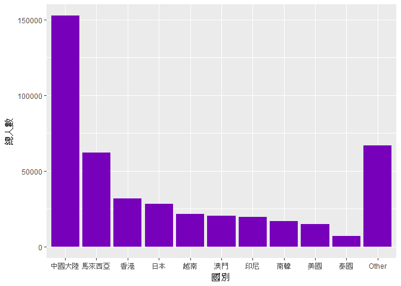
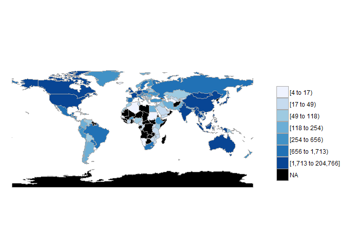
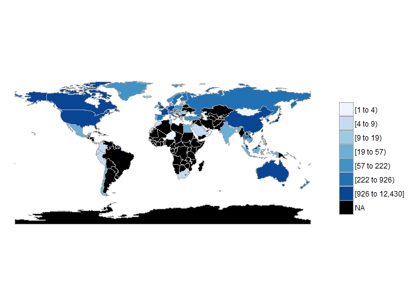
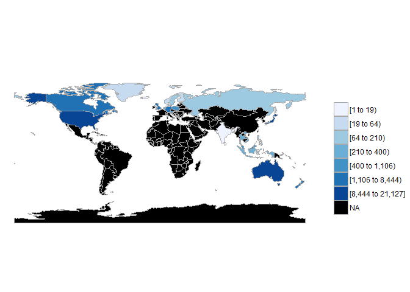
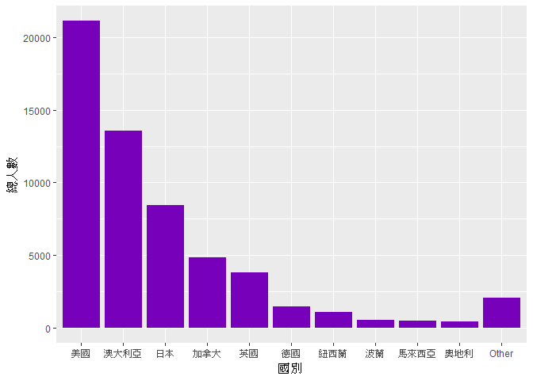
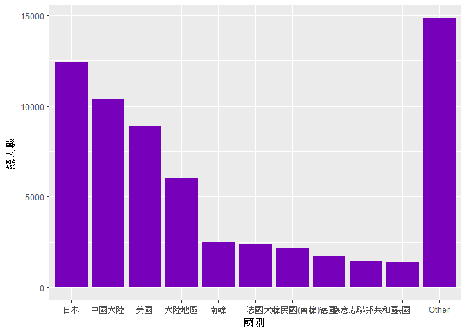

106-2 大數據分析方法 作業二
================
Yi-Ju Tseng

作業完整說明[連結](https://docs.google.com/document/d/1aLGSsGXhgOVgwzSg9JdaNz2qGPQJSoupDAQownkGf_I/edit?usp=sharing)

學習再也不限定在自己出生的國家，台灣每年有許多學生選擇就讀國外的大專院校，同時也有人多國外的學生來台灣就讀，透過分析[大專校院境外學生人數統計](https://data.gov.tw/dataset/6289)、[大專校院本國學生出國進修交流數](https://data.gov.tw/dataset/24730)、[世界各主要國家之我國留學生人數統計表](https://ws.moe.edu.tw/Download.ashx?u=C099358C81D4876CC7586B178A6BD6D5062C39FB76BDE7EC7685C1A3C0846BCDD2B4F4C2FE907C3E7E96F97D24487065577A728C59D4D9A4ECDFF432EA5A114C8B01E4AFECC637696DE4DAECA03BB417&n=4E402A02CE6F0B6C1B3C7E89FDA1FAD0B5DDFA6F3DA74E2DA06AE927F09433CFBC07A1910C169A1845D8EB78BD7D60D7414F74617F2A6B71DC86D17C9DA3781394EF5794EEA7363C&icon=..csv)可以了解103年以後各大專院校國際交流的情形。請同學分析以下議題，並以視覺化的方式呈現分析結果，呈現103年以後大專院校國際交流的情形。

來台境外生分析
--------------

### 資料匯入與處理

``` r
library(readr)
library(knitr)
library(kableExtra)
library(dplyr)
```

    ## 
    ## Attaching package: 'dplyr'

    ## The following objects are masked from 'package:stats':
    ## 
    ##     filter, lag

    ## The following objects are masked from 'package:base':
    ## 
    ##     intersect, setdiff, setequal, union

``` r
library(ggplot2)
library(ggmap)
library(choroplethr)
```

    ## Loading required package: acs

    ## Loading required package: stringr

    ## Loading required package: XML

    ## 
    ## Attaching package: 'acs'

    ## The following object is masked from 'package:dplyr':
    ## 
    ##     combine

    ## The following object is masked from 'package:base':
    ## 
    ##     apply

``` r
StudyInTW103Cou <-as.data.frame(read_csv("http://stats.moe.gov.tw/files/detail/103/103_ab103_C.csv"))
```

    ## Parsed with column specification:
    ## cols(
    ##   洲別 = col_character(),
    ##   國別 = col_character(),
    ##   `學位生-正式修讀學位外國生` = col_integer(),
    ##   `學位生-僑生(含港澳)` = col_integer(),
    ##   `學位生-正式修讀學位陸生` = col_integer(),
    ##   `非學位生-外國交換生` = col_integer(),
    ##   `非學位生-外國短期研習及個人選讀` = col_integer(),
    ##   `非學位生-大專附設華語文中心學生` = col_integer(),
    ##   `非學位生-大陸研修生` = col_integer(),
    ##   `非學位生-海青班` = col_integer(),
    ##   境外專班 = col_integer()
    ## )

``` r
StudyInTW103Uni <-as.data.frame(read_csv("http://stats.moe.gov.tw/files/detail/103/103_ab103_S.csv"))
```

    ## Parsed with column specification:
    ## cols(
    ##   學校類型 = col_character(),
    ##   學校代碼 = col_character(),
    ##   學校名稱 = col_character(),
    ##   `學位生-正式修讀學位外國生` = col_integer(),
    ##   `學位生-僑生(含港澳)` = col_integer(),
    ##   `學位生-正式修讀學位陸生` = col_integer(),
    ##   `非學位生-外國交換生` = col_integer(),
    ##   `非學位生-外國短期研習及個人選讀` = col_integer(),
    ##   `非學位生-大專附設華語文中心學生` = col_integer(),
    ##   `非學位生-大陸研修生` = col_character(),
    ##   `非學位生-海青班` = col_integer(),
    ##   境外專班 = col_integer()
    ## )

``` r
StudyInTW104Cou <-as.data.frame(read_csv("http://stats.moe.gov.tw/files/detail/104/104_ab104_C.csv"))
```

    ## Parsed with column specification:
    ## cols(
    ##   洲別 = col_character(),
    ##   國別 = col_character(),
    ##   `學位生-正式修讀學位外國生` = col_integer(),
    ##   `學位生-僑生(含港澳)` = col_integer(),
    ##   `學位生-正式修讀學位陸生` = col_integer(),
    ##   `非學位生-外國交換生` = col_integer(),
    ##   `非學位生-外國短期研習及個人選讀` = col_integer(),
    ##   `非學位生-大專附設華語文中心學生` = col_integer(),
    ##   `非學位生-大陸研修生` = col_integer(),
    ##   `非學位生-海青班` = col_integer(),
    ##   境外專班 = col_integer()
    ## )

``` r
StudyInTW104Uni <-as.data.frame(read_csv("http://stats.moe.gov.tw/files/detail/104/104_ab104_S.csv")) 
```

    ## Parsed with column specification:
    ## cols(
    ##   學校類型 = col_character(),
    ##   學校代碼 = col_character(),
    ##   學校名稱 = col_character(),
    ##   `學位生-正式修讀學位外國生` = col_integer(),
    ##   `學位生-僑生(含港澳)` = col_integer(),
    ##   `學位生-正式修讀學位陸生` = col_integer(),
    ##   `非學位生-外國交換生` = col_integer(),
    ##   `非學位生-外國短期研習及個人選讀` = col_integer(),
    ##   `非學位生-大專附設華語文中心學生` = col_integer(),
    ##   `非學位生-大陸研修生` = col_character(),
    ##   `非學位生-海青班` = col_integer(),
    ##   境外專班 = col_integer()
    ## )

``` r
StudyInTW105Cou <-as.data.frame(read_csv("http://stats.moe.gov.tw/files/detail/105/105_ab105_C.csv"))
```

    ## Parsed with column specification:
    ## cols(
    ##   洲別 = col_character(),
    ##   國別 = col_character(),
    ##   學位生_正式修讀學位外國生 = col_integer(),
    ##   `學位生_僑生(含港澳)` = col_integer(),
    ##   學位生_正式修讀學位陸生 = col_integer(),
    ##   非學位生_外國交換生 = col_integer(),
    ##   非學位生_外國短期研習及個人選讀 = col_integer(),
    ##   非學位生_大專附設華語文中心學生 = col_integer(),
    ##   非學位生_大陸研修生 = col_integer(),
    ##   非學位生_海青班 = col_integer(),
    ##   境外專班 = col_integer()
    ## )

``` r
StudyInTW105Uni <-as.data.frame(read_csv("http://stats.moe.gov.tw/files/detail/105/105_ab105_S.csv")) 
```

    ## Parsed with column specification:
    ## cols(
    ##   學校類型 = col_character(),
    ##   學校代碼 = col_character(),
    ##   學校名稱 = col_character(),
    ##   學位生_正式修讀學位外國生 = col_integer(),
    ##   `學位生_僑生(含港澳)` = col_integer(),
    ##   學位生_正式修讀學位陸生 = col_integer(),
    ##   非學位生_外國交換生 = col_integer(),
    ##   非學位生_外國短期研習及個人選讀 = col_integer(),
    ##   非學位生_大專附設華語文中心學生 = col_integer(),
    ##   非學位生_大陸研修生 = col_integer(),
    ##   非學位生_海青班 = col_integer(),
    ##   境外專班 = col_integer()
    ## )

``` r
StudyInTW106Cou <-as.data.frame(read_csv("http://stats.moe.gov.tw/files/detail/106/106_ab105_C.csv"))
```

    ## Parsed with column specification:
    ## cols(
    ##   洲別 = col_character(),
    ##   國別 = col_character(),
    ##   學位生_正式修讀學位外國生 = col_integer(),
    ##   `學位生_僑生(含港澳)` = col_integer(),
    ##   學位生_正式修讀學位陸生 = col_integer(),
    ##   非學位生_外國交換生 = col_integer(),
    ##   非學位生_外國短期研習及個人選讀 = col_integer(),
    ##   非學位生_大專附設華語文中心學生 = col_integer(),
    ##   非學位生_大陸研修生 = col_integer(),
    ##   非學位生_海青班 = col_integer(),
    ##   境外專班 = col_integer()
    ## )

``` r
StudyInTW106Uni <-as.data.frame(read_csv("http://stats.moe.gov.tw/files/detail/106/106_ab105_S.csv"))
```

    ## Parsed with column specification:
    ## cols(
    ##   學校類型 = col_character(),
    ##   學校代碼 = col_character(),
    ##   學校名稱 = col_character(),
    ##   學位生_正式修讀學位外國生 = col_integer(),
    ##   `學位生_僑生(含港澳)` = col_integer(),
    ##   學位生_正式修讀學位陸生 = col_integer(),
    ##   非學位生_外國交換生 = col_integer(),
    ##   非學位生_外國短期研習及個人選讀 = col_integer(),
    ##   非學位生_大專附設華語文中心學生 = col_integer(),
    ##   非學位生_大陸研修生 = col_integer(),
    ##   非學位生_海青班 = col_integer(),
    ##   境外專班 = col_integer()
    ## )

``` r
for(i in 3:11){
  StudyInTW103Cou[,i] <- as.numeric(StudyInTW103Cou[,i])
  StudyInTW104Cou[,i] <- as.numeric(StudyInTW104Cou[,i])
  StudyInTW105Cou[,i] <- as.numeric(StudyInTW105Cou[,i])
  StudyInTW106Cou[,i] <- as.numeric(StudyInTW106Cou[,i])
}

StudyInTW103Cou$total103<-rowSums(StudyInTW103Cou[,3:11],na.rm = T)
StudyInTW104Cou$total104<-rowSums(StudyInTW104Cou[,3:11],na.rm = T)
StudyInTW105Cou$total105<-rowSums(StudyInTW105Cou[,3:11],na.rm = T)
StudyInTW106Cou$total106<-rowSums(StudyInTW106Cou[,3:11],na.rm = T)

StudyInTW103Uni$`非學位生-大陸研修生` <- gsub("…",NA,StudyInTW103Uni$`非學位生-大陸研修生`)
StudyInTW104Uni$`非學位生-大陸研修生` <- gsub("…",NA,StudyInTW104Uni$`非學位生-大陸研修生`)

for(n in 4:12){
  StudyInTW103Uni[,n]<-as.numeric(StudyInTW103Uni[,n])
  StudyInTW104Uni[,n]<-as.numeric(StudyInTW104Uni[,n])
  StudyInTW105Uni[,n]<-as.numeric(StudyInTW105Uni[,n])
  StudyInTW106Uni[,n]<-as.numeric(StudyInTW106Uni[,n])
}

StudyInTW103Uni$total103<-rowSums(StudyInTW103Uni[,4:12],na.rm = T)
StudyInTW104Uni$total104<-rowSums(StudyInTW104Uni[,4:12],na.rm = T)
StudyInTW105Uni$total105<-rowSums(StudyInTW105Uni[,4:12],na.rm = T)
StudyInTW106Uni$total106<-rowSums(StudyInTW106Uni[,4:12],na.rm = T)

countryname<-read_csv("C:/Users/ASUS/Downloads/CountriesComparisionTable.csv")
```

    ## Parsed with column specification:
    ## cols(
    ##   ISO3 = col_character(),
    ##   English = col_character(),
    ##   Taiwan = col_character()
    ## )

``` r
colnames(countryname)<-c("ISO3","English","國別")
```

### 哪些國家來台灣唸書的學生最多呢？

``` r
StudyInTWAllCou <- full_join(StudyInTW103Cou,StudyInTW104Cou,by="國別")
StudyInTWAllCou <- full_join(StudyInTWAllCou,StudyInTW105Cou,by="國別")
StudyInTWAllCou <- full_join(StudyInTWAllCou,StudyInTW106Cou,by="國別")
StudyInTWAllCou$總人數 <- StudyInTWAllCou$total103+StudyInTWAllCou$total104+StudyInTWAllCou$total105+StudyInTWAllCou$total106
StudyInTWAllCou <- StudyInTWAllCou[order(StudyInTWAllCou$總人數,decreasing = T),]
StudyInTWAllCou <- select(StudyInTWAllCou,"洲別.x","國別","總人數")
colnames(StudyInTWAllCou) <- c("洲別","國別","總人數")

kable(head(StudyInTWAllCou,10))
```

|     | 洲別 | 國別     | 總人數 |
|-----|:-----|:---------|:------:|
| 1   | 亞洲 | 中國大陸 | 152524 |
| 2   | 亞洲 | 馬來西亞 |  62031 |
| 3   | 亞洲 | 香港     |  31940 |
| 4   | 亞洲 | 日本     |  28200 |
| 6   | 亞洲 | 越南     |  21670 |
| 5   | 亞洲 | 澳門     |  20302 |
| 8   | 亞洲 | 印尼     |  19620 |
| 7   | 亞洲 | 南韓     |  16948 |
| 121 | 美洲 | 美國     |  14846 |
| 9   | 亞洲 | 泰國     |  7035  |

### 哪間大學的境外生最多呢？

``` r
StudyInTWAllUni <- full_join(StudyInTW103Uni,StudyInTW104Uni,by="學校代碼")
StudyInTWAllUni <- full_join(StudyInTWAllUni,StudyInTW105Uni,by="學校代碼")
StudyInTWAllUni <- full_join(StudyInTWAllUni,StudyInTW106Uni,by="學校代碼")
StudyInTWAllUni$總人數 <- StudyInTWAllUni$total103+StudyInTWAllUni$total104+StudyInTWAllUni$total105+StudyInTWAllUni$total106
StudyInTWAllUni <- StudyInTWAllUni[order(StudyInTWAllUni$總人數,decreasing = T),]
StudyInTWAllUni <- select(StudyInTWAllUni,"學校類型.x","學校名稱.x","總人數")  
colnames(StudyInTWAllUni) <- c("學校類型","學校名稱","總人數")

kable(head(StudyInTWAllUni,10))
```

|     | 學校類型 | 學校名稱         | 總人數 |
|-----|:---------|:-----------------|:------:|
| 4   | 大專校院 | 國立臺灣師範大學 |  22113 |
| 3   | 大專校院 | 國立臺灣大學     |  18199 |
| 55  | 大專校院 | 中國文化大學     |  16074 |
| 65  | 大專校院 | 銘傳大學         |  16057 |
| 54  | 大專校院 | 淡江大學         |  13887 |
| 1   | 大專校院 | 國立政治大學     |  11626 |
| 6   | 大專校院 | 國立成功大學     |  10982 |
| 51  | 大專校院 | 輔仁大學         |  9499  |
| 56  | 大專校院 | 逢甲大學         |  9474  |
| 53  | 大專校院 | 中原大學         |  7662  |

### 各個國家來台灣唸書的學生人數條狀圖

``` r
Q2Data <- group_by(StudyInTWAllCou,國別) %>%
  tally(總人數, sort = TRUE) %>%
  group_by(國別 = factor(c(國別[1:10], rep("Other", n() - 10)),
                            levels = c(國別[1:10], "Other"))) %>%
  tally(n) 

colnames(Q2Data) <- c("國別","總人數")

ggplot()+geom_bar(data=Q2Data,aes(x=國別,y=總人數), stat = "identity",fill="#7700BB") + theme_get()
```



### 各個國家來台灣唸書的學生人數面量圖

``` r
ETotalCountry<-merge(StudyInTWAllCou,countryname,by="國別")
colnames(ETotalCountry)<-c("國別","洲別","value","ISO3","region")

ETotalCountry[5,3]<-ETotalCountry[5,3]+ETotalCountry[91,3]+ETotalCountry[159,3]
ETotalCountry[107,3]<-ETotalCountry[107,3]+ETotalCountry[108,3]
ETotalCountry<-ETotalCountry%>%
  subset(region!="Unmatch")%>%
  subset(國別!="索馬利蘭共和國")
ans3<-country_choropleth(ETotalCountry)
ans3
```



台灣學生國際交流分析
--------------------

### 資料匯入與處理

``` r
StudyOutsideData <- as.data.frame(read_csv("C:/Users/ASUS/Downloads/Student_RPT_07.csv"))
```

    ## Parsed with column specification:
    ## cols(
    ##   本國學生出國進修交流數 = col_character(),
    ##   X2 = col_character(),
    ##   X3 = col_character(),
    ##   X4 = col_character(),
    ##   X5 = col_character(),
    ##   X6 = col_character(),
    ##   X7 = col_character(),
    ##   X8 = col_character(),
    ##   X9 = col_character(),
    ##   X10 = col_character(),
    ##   X11 = col_character(),
    ##   X12 = col_character(),
    ##   X13 = col_character(),
    ##   總計 = col_character(),
    ##   `64239` = col_character()
    ## )

``` r
StudyOutsideData <- StudyOutsideData[c(-1,-2),]
colnames(StudyOutsideData) <- c("學年度","學期","設立別","學校類別","學校代碼",
                               "學校名稱","系所代碼","系所名稱","學制","對方學校國別",
                               "對方學校名稱","英文名稱","交流人數","男","女")
```

### 台灣大專院校的學生最喜歡去哪些國家進修交流呢？

``` r
StudyOutsideCou <- group_by(StudyOutsideData,對方學校國別)%>%summarise(CountyTotal = sum(as.numeric(交流人數)))%>%
  arrange(desc(CountyTotal))
colnames(StudyOutsideCou) <- c("學校國別","總計人數")
kable(head(StudyOutsideCou,10))
```

| 學校國別         | 總計人數 |
|:-----------------|:--------:|
| 日本             |   12430  |
| 中國大陸         |   10429  |
| 美國             |   8916   |
| 大陸地區         |   5996   |
| 南韓             |   2498   |
| 法國             |   2415   |
| 大韓民國(南韓)   |   2131   |
| 德國             |   1706   |
| 德意志聯邦共和國 |   1458   |
| 英國             |   1416   |

### 哪間大學的出國交流學生數最多呢？

``` r
StudyOutsideUni <- group_by(StudyOutsideData,對方學校名稱)%>%summarise(CountyTotal = sum(as.numeric(交流人數)))%>%
  arrange(desc(CountyTotal))
colnames(StudyOutsideUni) <- c("學校名稱","總計人數")
kable(head(StudyOutsideUni,10))
```

| 學校名稱     | 總計人數 |
|:-------------|:--------:|
| 同濟大學     |    894   |
| 上海交通大學 |    648   |
| 北京大學     |    548   |
| 復旦大學     |    520   |
| 廈門大學     |    457   |
| 中國人民大學 |    456   |
| 南京大學     |    448   |
| 馬來亞大學   |    425   |
| 吉林大學     |    372   |
| 集美大學     |    368   |

### 台灣大專院校的學生最喜歡去哪些國家進修交流條狀圖

``` r
colnames(StudyOutsideCou) <- c("國別","總人數")

Q5Data <- group_by(StudyOutsideCou,國別) %>%
  tally(總人數, sort = TRUE) %>%
  group_by(國別 = factor(c(國別[1:10], rep("Other", n() - 10)),
                       levels = c(國別[1:10], "Other"))) %>%
  tally(n) 

colnames(Q5Data) <- c("國別","總人數")

ggplot()+geom_bar(data=Q5Data,aes(x=國別,y=總人數),stat = "identity",fill="#7700BB")+theme_get()
```


### 台灣大專院校的學生最喜歡去哪些國家進修交流面量圖

``` r
colnames(StudyOutsideCou) <- c("國別","總計人數")
WTotalCountry<-merge(StudyOutsideCou,countryname,by="國別")
colnames(WTotalCountry)<-c("國別","value","ISO3","region")

WTotalCountry[5,2]<-WTotalCountry[5,2]+WTotalCountry[91,2]+WTotalCountry[159,2]
WTotalCountry[107,2]<-WTotalCountry[107,2]+WTotalCountry[108,2]
WTotalCountry<-WTotalCountry%>%
  subset(region!="Unmatch")%>%
  subset(國別!="索馬利蘭共和國")
ans6<-country_choropleth(WTotalCountry)
ans6
```



台灣學生出國留學分析
--------------------

### 資料匯入與處理

``` r
OutsideL <- as.data.frame(read_csv("https://ws.moe.edu.tw/Download.ashx?u=C099358C81D4876CC7586B178A6BD6D5062C39FB76BDE7EC7685C1A3C0846BCDD2B4F4C2FE907C3E7E96F97D24487065577A728C59D4D9A4ECDFF432EA5A114C8B01E4AFECC637696DE4DAECA03BB417&n=4E402A02CE6F0B6C1B3C7E89FDA1FAD0B5DDFA6F3DA74E2DA06AE927F09433CFBC07A1910C169A1845D8EB78BD7D60D7414F74617F2A6B71DC86D17C9DA3781394EF5794EEA7363C&icon=..csv"))
```

    ## Parsed with column specification:
    ## cols(
    ##   洲別 = col_character(),
    ##   國別 = col_character(),
    ##   總人數 = col_number(),
    ##   X4 = col_character(),
    ##   X5 = col_character(),
    ##   X6 = col_character()
    ## )

``` r
OutsideL$X4 <- NULL
OutsideL$X5 <- NULL
OutsideL$X6 <- NULL
```

### 台灣學生最喜歡去哪些國家留學呢？

``` r
OutsideL <- OutsideL[order(OutsideL$總人數,decreasing = T),]
kable(head(OutsideL,10))
```

|     | 洲別   | 國別     | 總人數 |
|-----|:-------|:---------|:------:|
| 14  | 美洲   | 美國     |  21127 |
| 15  | 大洋洲 | 澳大利亞 |  13582 |
| 17  | 亞洲   | 日本     |  8444  |
| 13  | 美洲   | 加拿大   |  4827  |
| 1   | 歐洲   | 英國     |  3815  |
| 2   | 歐洲   | 德國     |  1488  |
| 16  | 大洋洲 | 紐西蘭   |  1106  |
| 3   | 歐洲   | 波蘭     |   561  |
| 21  | 亞洲   | 馬來西亞 |   502  |
| 4   | 歐洲   | 奧地利   |   419  |

### 台灣學生最喜歡去哪些國家留學面量圖

``` r
colnames(OutsideL) <- c("洲別","國別","總計人數")
MTotalCountry<-merge(OutsideL,countryname,by="國別")
colnames(MTotalCountry)<-c("國別","洲別","value","ISO3","region")

MTotalCountry[5,3]<-MTotalCountry[5,3]+MTotalCountry[91,3]+MTotalCountry[159,3]
MTotalCountry[107,3]<-MTotalCountry[107,3]+MTotalCountry[108,3]
MTotalCountry<-MTotalCountry%>%
  subset(region!="Unmatch")%>%
  subset(國別!="索馬利蘭共和國")
ans8<-country_choropleth(MTotalCountry)
ans8
```



綜合分析
--------

請問來台讀書與離台讀書的來源國與留學國趨勢是否相同(5分)？想來台灣唸書的境外生，他們的母國也有很多台籍生嗎？請圖文並茂說明你的觀察(10分)。

``` r
##請問來台讀書與離台讀書的來源國與留學國趨勢是否相同##
##否，如果就學生來說，以下兩張圖可發現來台讀書與離台讀書的來源國與留學國趨勢不同

##來台灣唸書的學生前10分布國家
Q2Data <- group_by(StudyInTWAllCou,國別) %>%
  tally(總人數, sort = TRUE) %>%
  group_by(國別 = factor(c(國別[1:10], rep("Other", n() - 10)),
                            levels = c(國別[1:10], "Other"))) %>%
  tally(n) 

colnames(Q2Data) <- c("國別","總人數")

ggplot()+geom_bar(data=Q2Data,aes(x=國別,y=總人數), stat = "identity",fill="#7700BB") + theme_get()
```


``` r
##台灣學生去各國家留學前10人數
testData <- group_by(OutsideL,國別) %>%
  tally(總計人數, sort = TRUE) %>%
  group_by(國別 = factor(c(國別[1:10], rep("Other", n() - 10)),
                       levels = c(國別[1:10], "Other"))) %>%
  tally(n) 

colnames(testData) <- c("國別","總人數")

ggplot()+geom_bar(data=testData,aes(x=國別,y=總人數), stat = "identity",fill="#7700BB") + theme_get()
```



``` r
##但如果用大專院校的學生來說，以下兩張圖可發現來台讀書與離台讀書的來源國與留學國趨勢大致相同

##來台灣唸書的學生前10分布國家
Q2Data <- group_by(StudyInTWAllCou,國別) %>%
  tally(總人數, sort = TRUE) %>%
  group_by(國別 = factor(c(國別[1:10], rep("Other", n() - 10)),
                            levels = c(國別[1:10], "Other"))) %>%
  tally(n) 

colnames(Q2Data) <- c("國別","總人數")

ggplot()+geom_bar(data=Q2Data,aes(x=國別,y=總人數), stat = "identity",fill="#7700BB") + theme_get()
```


``` r
##台灣大專院校的學生最喜歡去進修的前10國家
colnames(StudyOutsideCou) <- c("國別","總人數")

Q5Data <- group_by(StudyOutsideCou,國別) %>%
  tally(總人數, sort = TRUE) %>%
  group_by(國別 = factor(c(國別[1:10], rep("Other", n() - 10)),
                       levels = c(國別[1:10], "Other"))) %>%
  tally(n) 

colnames(Q5Data) <- c("國別","總人數")

ggplot()+geom_bar(data=Q5Data,aes(x=國別,y=總人數),stat = "identity",fill="#7700BB")+theme_get()
```



``` r
##想來台灣唸書的境外生，他們的母國也有很多台籍生嗎？


##由以下圖可看到前10名來台灣唸書學生的國家為中國、馬來西亞、香港、日本、越南、澳門、印尼、南韓、美國、泰國、、


##來台灣唸書的學生前10分布國家
Q2Data <- group_by(StudyInTWAllCou,國別) %>%
  tally(總人數, sort = TRUE) %>%
  group_by(國別 = factor(c(國別[1:10], rep("Other", n() - 10)),
                            levels = c(國別[1:10], "Other"))) %>%
  tally(n) 

colnames(Q2Data) <- c("國別","總人數")

ggplot()+geom_bar(data=Q2Data,aes(x=國別,y=總人數), stat = "identity",fill="#7700BB") + theme_get()
```


``` r
##台灣大專院校的學生最喜歡去的前10名國家為日本、中國大陸、美國、大陸地區、南韓、法國、大韓民國(南韓)、德國、德意志聯邦共和國、英國


##台灣大專院校的學生最喜歡去進修的前10國家
colnames(StudyOutsideCou) <- c("國別","總人數")

Q5Data <- group_by(StudyOutsideCou,國別) %>%
  tally(總人數, sort = TRUE) %>%
  group_by(國別 = factor(c(國別[1:10], rep("Other", n() - 10)),
                       levels = c(國別[1:10], "Other"))) %>%
  tally(n) 

colnames(Q5Data) <- c("國別","總人數")

ggplot()+geom_bar(data=Q5Data,aes(x=國別,y=總人數),stat = "identity",fill="#7700BB")+theme_get()
```


``` r
##可以得到想來台灣唸書的境外生，他們的母國也有很多台籍生!!
```
